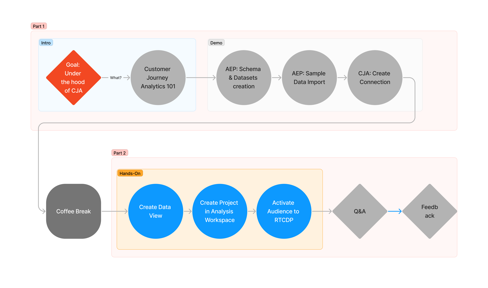

# Customer Journey Analytics Hands-on Workshop (February 2023)

## Goal

Look under the hood of how Customer Journey Analytics helps customers connect every customer touchpoint to give teams the insights they need to build incredible customer experiences at scale.

## Agenda

- CJA Jumpstart: How it works (Intro)
- CJA Sandbox Quick Setup: Data Collection (Demo)
- Coffee Break
- Analysis Workspace: Omni-channel Interactive Query (Hands-on)
- Q&A

## Audience

Technical Seller, Consultants, Business Analysts, Data Analysts, Data Architects.

## Workshop Prerequisites
* Access to Adobe Experience Platform (sandbox)
* Admin to Adobe Customer Journey Analytics (sandbox)

## Tutorial

NOTE: If you're part of in-person workshop you can skip to section Create CJA Connection (previous steps have been setup for you).

### Quick Setup with DSN (optional, if using own sandbox)
* Go to https://dsn.adobe.com/quick-setup.
* Select your environment, configuration and a preset. 
* Provide title for your workspace and data collection libraries.
* Check new schemas and datasets created in the sandbox.

### Generate/Download Sample Data Files
* Download sample data here: [link]().
* Open the files in text editor and review what data it contains.

### Upload Sample Data to AEP Data Lake
* Go to https://experience.adobe.com/#/@aeppartner1/sname:prod/platform/dataset/browse to see your datasets.
* Open the following datasets and drop the sample data (*.csv) to the Add Data section on the right-hand side panel:
	* Demo System - Event Dataset for Website (Global v1.1)
	* Demo System - Event Dataset for Mobile App (Global v1.1)
	* Demo System - Event Dataset for Call Center (Global v1.1)
	* Demo System - Event Dataset for POS (Global v1.1)
	
### Validate Data Ingestion
* Ingestion of this size of data can take between 30-60 mins.
* Go to https://experience.adobe.com/#/@aeppartner1/sname:prod/platform/monitoring/batch and check all datasets have finished the ingestion of sample data.

### Create CJA Connection
* Open CJA UI from the top level navigation.
* Open the Connections tab: https://experience.adobe.com/#/@aeppartner1/platform/analytics/#/connections2/manager.
* Click Create new connection button.
* Provide Connection name, AEP sandbox from a dropdown and Average number of daily events (less than 1 million).
* Click Add Datasets
	* Select one of the datasets you used for sample data, click Next
	* Specify PersonId (crmId), Timestamp (timestamp), Data Source Type (Web Data).
	* Enable Import all new data and Backfill all existing data. 
	* Repeat this process for the other datasets (using the same PersonId).
*Review the setup and ingestion progress on Connection overview.
* The ingestion to CJA Connection might take approximately 1 hr.

### Create CJA Data View
* Open the Data Views tab.
* Click Create new data view.
	* Configure the data view (use the Connection created previously)
	* Add the following dimensions and metrics:
		* Metrics
			* Page Views (schema path: web.webPageDetails.pageViews.value)
			* Product Views (commerce.productViews.value)
			* Checkouts (commerce.checkouts.value)
			* Purchases (commerce.purchases.value)
			* Revenue (productListItems.priceTotal)
			* Quantity (productListItems.quantity)
			* Call Time Elapsed (_aeppartner1.interactionDetails.core.callCenterAgent.callTimeElapsed)

		* Dimensions
			* Event Type (eventType)
			* Product Name (productListItems.name)
			* Product SKU (productListItems.SKU)
			* Call Topic (_aeppartner1.interactionDetails.core.callCenterAgent.callTopic)
			* Marketing Campaign (marketing.campaignName)
			* Interaction Channel (_aeppartner1.interactionDetails.core.channel)
			* Person ID (Standard Components)
			* Dataset ID (Standard Components)
	* Review Settings and Save

### Create CJA Project

* Go to Workspaces and click on Create New.
* Start from a blank project.
* Please download the CJA project dashboard [here]() and try to recreate the same dashboard (using your own Data View).
* Experiment with new visualizations and feel free to explore the data in different direction.

### Analyze Data and Publish Segment to RT-CDP

* Try to find some interesting nugget of insight.
* When you've found it, right-click on one of the table rows and select Create Audience From Selection
* Review the the Audience Creation modal and name your new Audience.
* Notice the right column with audience estimates and click Publish.

### Use RT-CDP To Activate The Audience

* Move to RT-CDP platform.adobe.com
* Navigate in the left menu to: Segments and tab Browse
* You'll see your new audience from CJA in the list
* Open your segment and click on Activate to Destination
* Select one of the available destinations from the list

## Resources
* [https://business.adobe.com/products/customer-journey-analytics/adobe-customer-journey-analytics.html](https://business.adobe.com/products/customer-journey-analytics/adobe-customer-journey-analytics.html) (product page)
* [https://experienceleague.adobe.com/docs/analytics-platform/using/cja-overview/cja-overview.html?lang=en](https://experienceleague.adobe.com/docs/platform-learn/implement-web-sdk/overview.html) (documentation)
* [https://experienceleague.adobe.com/docs/platform-learn/implement-web-sdk/overview.html](https://experienceleague.adobe.com/docs/platform-learn/implement-web-sdk/overview.html) (data collection web sdk)
* [https://experienceleague.adobe.com/docs/analytics-platform/using/cja-dataviews/create-dataview.html?lang=en](https://experienceleague.adobe.com/docs/analytics-platform/using/cja-dataviews/create-dataview.html?lang=en) (create data view)
* [https://experienceleague.adobe.com/docs/analytics-platform/using/cja-workspace/home.html?lang=en](https://experienceleague.adobe.com/docs/analytics-platform/using/cja-workspace/home.html?lang=en) (create project in analysis workspace)

## Feedback

We will be more than happy to hear about your experience today. 

Any suggestions how to imporve this series are highly valuable to us and we value your feedback hugely. 

Link: [https://forms.office.com/]()

Thank you for your time and we wish you the best success with Adobe.
